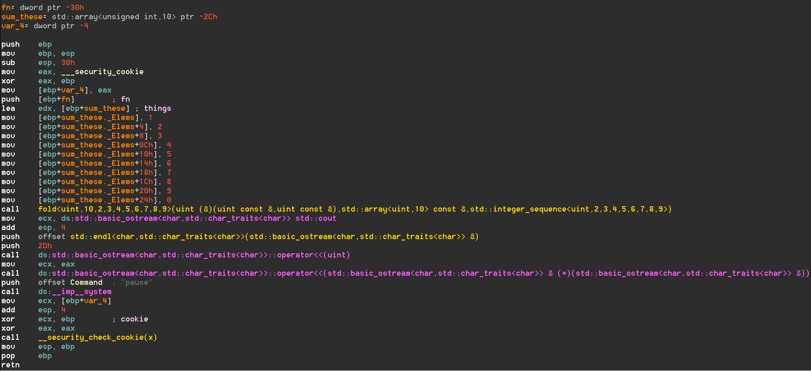
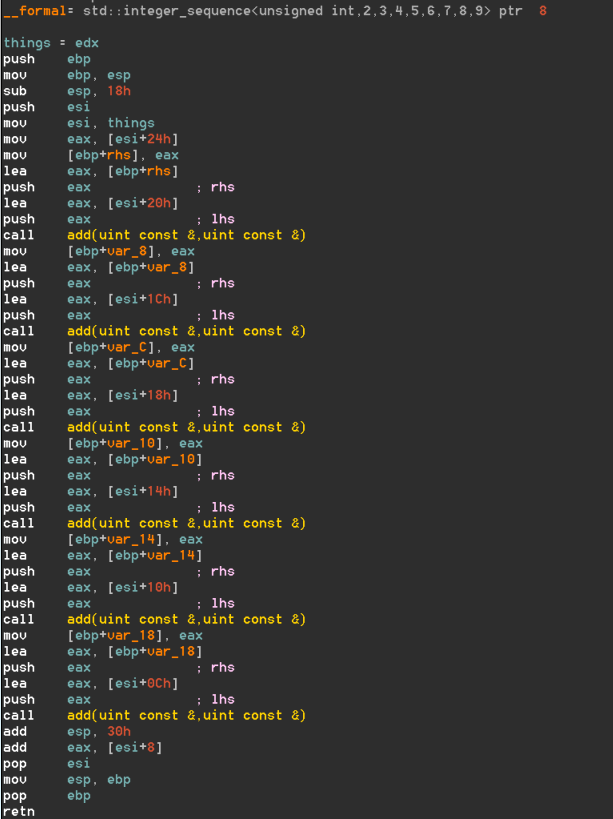

# MSVC2015 Community Bug

I recently learned about the C++17 [fold expression](http://en.cppreference.com/w/cpp/language/fold).
They're pretty dope. Unfortunately currently unsupported in visual studio 15 [(N4295)](https://msdn.microsoft.com/en-us/library/hh567368.aspx).

Visual studio is my favorite IDE so I wrote a simple fold function that can be evaluated by the compiler statically.

```c++
template<class T, size_t N, size_t F> constexpr
T fold(T(&fn)(const T&, const T&), const array<T, N>& things, index_sequence<F>) {
	return things[F];
}

template<class T, size_t N, size_t F, size_t... I> constexpr
decltype(auto) fold(T(&fn)(const T&, const T&), const array<T, N>& things, index_sequence<F, I...>) {
	return fn(things[F], fold(fn, things, index_sequence<I...>()));
}

template<class T, size_t N> constexpr
decltype(auto) fold(T(&fn)(const T&, const T&), const array<T, N>& things) {
	return fold(fn, things, make_index_sequence<N>());
}
```
I think auto is great. Deal with it.

I then wrote a program to make sure that my implementation of fold works.

```c++
constexpr size_t add(const size_t& lhs, const size_t& rhs) {
	return lhs + rhs;
}

int main() {
	constexpr array<size_t, 10> sum_these = { 1,2,3,4,5,6,7,8,9,0 };
	constexpr auto sum = fold(add, sum_these);
	cout << sum << endl;
	system("pause");
}
```
As you can see, the compiler should be able to find the value of sum and in doing so optimize away the functions `fold` and `add` as well as the local variable `sum_these` in main. If you run the program the value `45` is printed. If you disassemble the program to verify it contains only the main function you will be horrified.
## IDA screen shots





## Errors

Here is a breakdown of everything wrong with this program.

* There should be no code emitted for `fold`

* In preparation for the call to fold, the `fn` argument is pushed. It is never initialized

* In the body of `fold`, it appears that the `add` function has been propagated six times and inlined once at the end for a total of 7 calls. That's two too few

* Fold generates the value `43` when executed. It should be `45`. It doesn't operate on the first two elements of `sum_these`

* The return value of `fold` isn't saved

* Visual studio LOLJKs and inserts the compile time computed `45` before the call to `cout<<`


I'm not an expert at metaprogramming. I'm reasonably sure that these are VS errors instead of my errors. Either way I thought documenting this constellation of errors would be valuable. 


## notes
MSVC version:
Microsoft Visual Studio Community 2015
Version 14.0.24720.00 Update 1

Compiler flags:
```
/GS /GL /analyze- /W3 /Gy /Zc:wchar_t /Zi /Gm- /O2 /sdl /Fd"Release\vc140.pdb" /Zc:inline /fp:precise /D "_MBCS" /errorReport:prompt /WX- /Zc:forScope /Gd /Oy- /Oi /MD /Fa"Release\" /EHsc /nologo /Fo"Release\" /Fp"Release\bug.pch" 
```

Linker flags:
```
/OUT:"c:\users\lol\documents\visual studio 2015\Projects\bug\Release\bug.exe" /MANIFEST /LTCG:incremental /NXCOMPAT /PDB:"c:\users\lol\documents\visual studio 2015\Projects\bug\Release\bug.pdb" /DYNAMICBASE "kernel32.lib" "user32.lib" "gdi32.lib" "winspool.lib" "comdlg32.lib" "advapi32.lib" "shell32.lib" "ole32.lib" "oleaut32.lib" "uuid.lib" "odbc32.lib" "odbccp32.lib" /DEBUG /MACHINE:X86 /OPT:REF /SAFESEH /PGD:"c:\users\lol\documents\visual studio 2015\Projects\bug\Release\bug.pgd" /MANIFESTUAC:"level='asInvoker' uiAccess='false'" /ManifestFile:"Release\bug.exe.intermediate.manifest" /OPT:ICF /ERRORREPORT:PROMPT /NOLOGO /TLBID:1 
```


